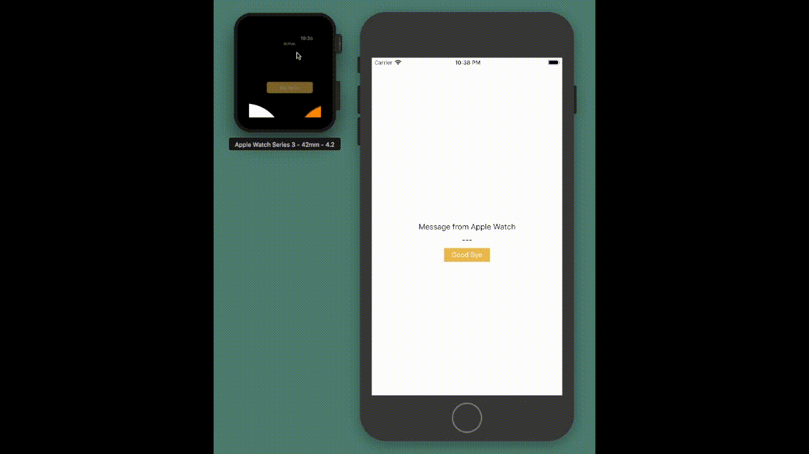

# WCSession Reactive Extension
Inspired by RxSwft's CLLocationManager+Rx
https://github.com/ReactiveX/RxSwift/tree/master/RxExample/Extensions

## Useage

```swift
import WatchKit
import WatchConnectivity
import RxSwift
import WCSessionRx

class InterfaceController: WKInterfaceController {
    
    private var disposer: Disposable?
    
    override func awake(withContext context: Any?) {
        super.awake(withContext: context)
        
        disposer = WCSession.default()
            .rx.activationState
            .subscribe(onNext: {
                
                print("Activation State is \($0)")
                
            }, onError: {
                
                print("Error \($0)")
                
            }, onCompleted: {
                
            }) {
                
                print("Canceled \($0)")
                
        }
    }
    
    override func willActivate() {
        super.willActivate()
        WCSession.default().activate()
    }
    
    deinit {
        disposer?.dispose()
    }

}
```

## Demo
Source code: [Demo Project](https://github.com/shintarogit/wcsession_rx/tree/master/Demo)


## Requirements
+ watchOS 2.2

## Installation
### CocoaPods
```Ruby
# Podfile
use_frameworks!

target 'YOUR_WATCH_EXTENSION_TARGET_NAME' do
  pod 'RxSwift',    '~> 4.0'
  pod 'RxCocoa',    '~> 4.0'
  pod 'WCSessionRx'
end

```
Replace YOUR_WATCH_EXTENSION_TARGET_NAME and then, in the Podfile directory, type:
```sh
pod install
```
